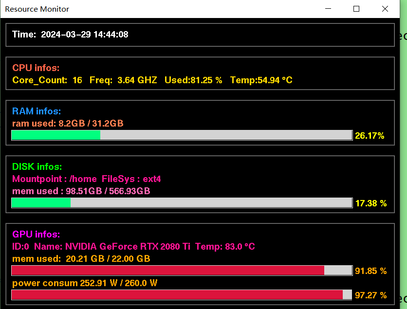

## 资源监视器
### 编程语言
python
### 项目简介
本项目主要用于监视计算机的资源情况，主要包含了CPU使用情况，温度，RAM使用量，DISK的使用情况以及GPU的温度以及使用情况，具体可以参考下图

### 安装说明
```bash
pip install -r requirments.txt 
```
### 使用说明
有两种模式，一种是console mode，一种是GUI mode
python Monitor.py 1-console mode 2-GUI mode

### TODO
.增加网络信息
.多线程获取资源
.优化自动获取多GPU信息
.显示CPU每个物理核的使用率


## 关于作者
* warren@伟
* 个人博客：其他内容可以参考我的博客[CSDN-warren@伟](https://blog.csdn.net/warren103098?type=blog)


